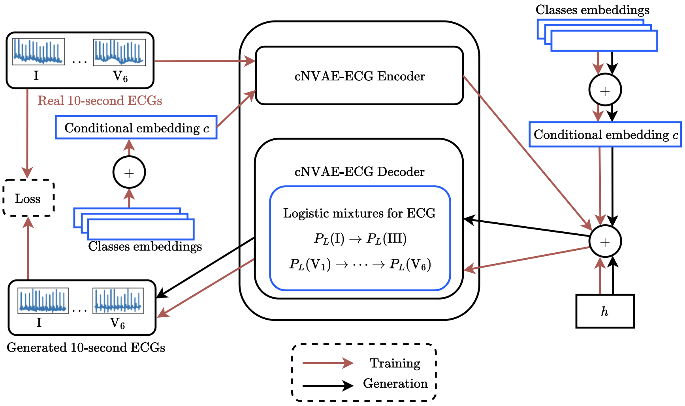

# Code for the "Conditional Electrocardiogram Generation Using Hierarchical Variational Autoencoders" Paper

[](https://arxiv.org/abs/2503.13469)

cNVAE-ECG is a model based on [NVAE](https://github.com/NVlabs/NVAE) for conditional generation of 12 main-lead ECG signals longer than one heartbeat.

<p align="center">
    
</p>

### To train cNVAE-ECG model:
0. Download [PTB-XL, Ningbo and Georgia datasets](https://physionet.org/content/challenge-2021/1.0.3/);
1. Install dependencies from the ```requirements.txt``` file;
2. Go to the *scripts* directory;
3. Run ```prepare_data.sh``` script to prepare datasets;
4. After data preparing, run the ```training_conditional.sh``` script with specified parameters;
5. After training, run evaluation with the ```evaluating_conditional.sh``` script with specified parameters.

---

### To train conditional Pulse2Pulse and WaveGAN* models:
0. Clone our [fork of the original repository](https://github.com/univanxx/Pulse2Pulse);
1. Run ```pulse2pulse_train.sh``` and ```wavegan_star_train.sh``` with specified parameters;
2. Generate signals with the ```generate_samples.sh``` script.

---

### To run testing on downstream tasks:
0. Go to the *train_test* directory;
1. Clone code from our fork of the benchmarking repository [ecg_ptbxl_benchmarking repository](https://github.com/univanxx/ecg_ptbxl_benchmarking) to obtain XResNet;
#### Binary classification - direct training set enrichment
For comparing enrichment of the direct training set enrichment methods for the binary classification task, run the ```enrich_train.sh``` script with specified parameters;
#### Multi-label classification - transfer learning
To compare results for the transfer learning setting for the multi-label classification, run the ```enrich_pretrain.sh``` script with specified parameters for each method.

---

#### BibTeX reference
```
@misc{sviridov2025conditionalelectrocardiogramgenerationusing,
      title={Conditional Electrocardiogram Generation Using Hierarchical Variational Autoencoders}, 
      author={Ivan Sviridov and Konstantin Egorov},
      year={2025},
      eprint={2503.13469},
      archivePrefix={arXiv},
      primaryClass={eess.SP},
      url={https://arxiv.org/abs/2503.13469}, 
}
```

---

Thank you for your interest in our work! If you have any questions, feel free to open an issue or contact Ivan at wchhiaarid@gmail.com.
